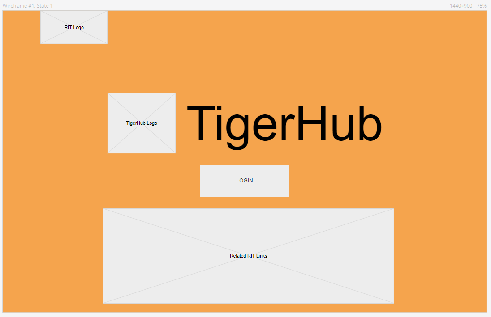
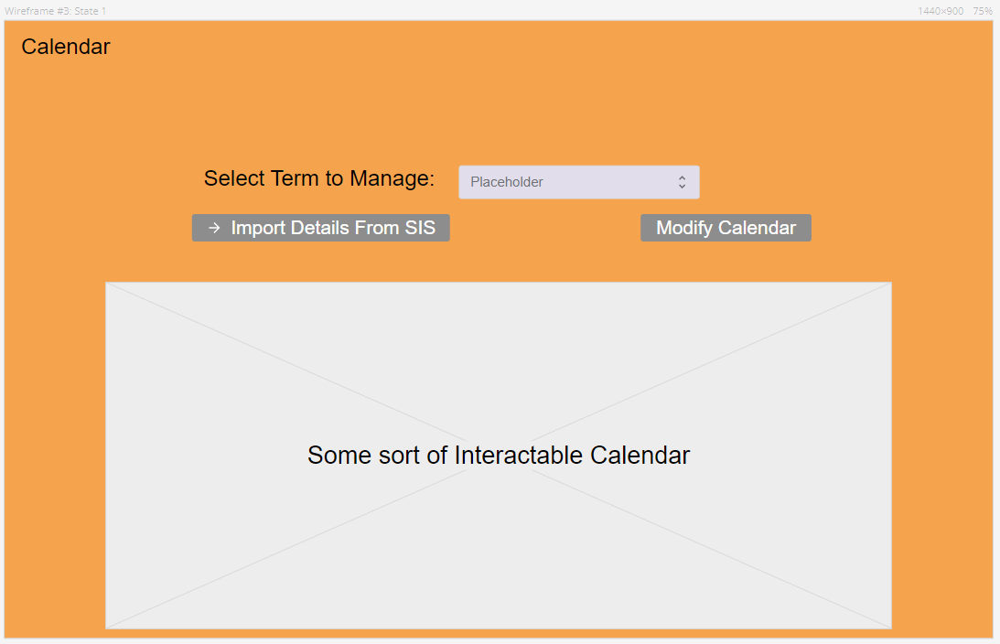

# TigerHub-Team-Project

## IMPORTANT NOTICE:

This is a copy of an academic *Team* Project Created By:

- Daniyah Wong - dkw8800@g.rit.edu
- Laura Chen - lc6071@g.rit.edu
- Michael Nersinger - mnn7135@g.rit.edu
- Nikkia Theodule - njt7621@g.rit.edu
- Jonah Micek - jonahamicek@gmail.com

During our tenure at RIT, specifically in the class User Experience/User Interface Design Class, or SWEN-444. I (Jonah Micek) have copied this project to ensure that the Proto.io demo of this UX/UI project survives, in the case of potential employers' interest in seeing this particular project in-action. Aside from this README document, made no changes to any of the code. I in no way take any full claim to the work completed on this project.

### Running the Project Demo

To run the project demo, simply clone this repository to your desired location and open ```preview.html``` in your desired browser.

General Information about the project is detailed below:

***

### System Concept

The premise for this project idea was that our University, RIT, had too many separate web applications for all of its services. At some point before we had arrived, students had created a web application called TigerCenter, which was intended to bring a bunch of these services together; however, RIT chose not to go through with TigerCenter after its first test use, as the developers had failed to account for proper horizontal scaling of the service. (It crashed due to heavy traffic)

Our goal was to create a prototype for a similar website, one that would be even more improved than TigerCenter. We came up with the following general soft requirements to fulfill:

- TigerHub will serve as a centralized web page which hosts multiple RIT services such as TigerCenter and SIS (Student Information System)
- TigerHub will ensure that all related RIT Information is brought right to the user, instead of scattered across several sites (in this context, due to COVID-19, the school's EServices page had its Dining Plan services removed, meaning that RIT financial inforamtion was technically split between two different services)
- TigerHub Shall provide an easy-to-use, simpler, less-busy, and better formatted webpage than the services that currently exist seperately
- TigerHub will be designed in such a modular way that more RIT services could easily be added later in the future.
***

More specific design requirements in our TigerHub prototype included:
- Course Enrollment
- Viewing RIT Campus Locations & Services
- Calendar management and manipulation
- Ability for user sign-in similar to current RIT sites
- Viewing Academic Records similar to SIS

***

### Initial Wireframes



